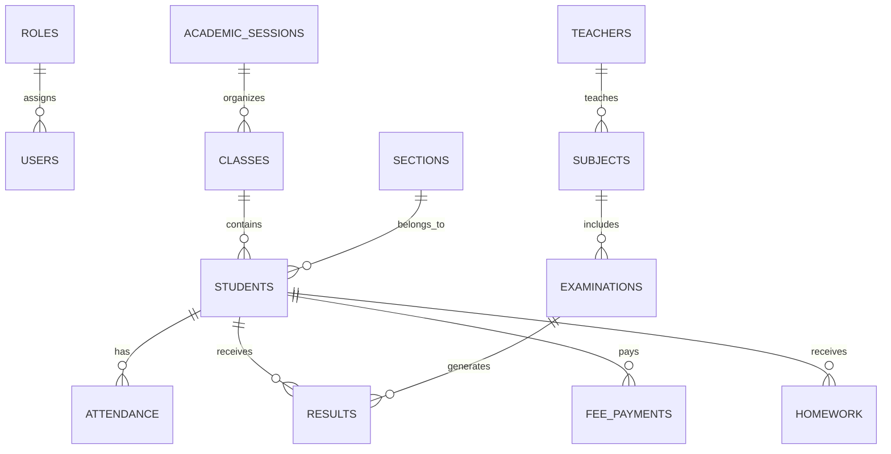

# DB-002 - Entity Relationship Diagram (ERD)

| Field | Value |
|-------|-------|
| Project | T.N. Memorial School Digital Platform |
| Document ID | DB-002 |
| Version | 1.0 |
| Status | Draft |
| Author | Project Team |
| Reviewer | ChatGPT (Tech Lead) |
| Approver | Project Manager |
| Created On | 2026-06-30 |
| Last Updated | 2026-06-30 |

---

# 1. Purpose

This document provides the logical Entity Relationship Diagram (ERD) for the T.N. Memorial School Digital Platform using Mermaid syntax.

---

# 2. Mermaid ER Diagram

---

# 3. Relationship Summary

| Parent | Child | Cardinality |
|---------|-------|-------------|
| Roles | Users | 1 : N |
| Classes | Students | 1 : N |
| Sections | Students | 1 : N |
| Teachers | Subjects | 1 : N |
| Students | Attendance | 1 : N |
| Students | Results | 1 : N |
| Students | Fee Payments | 1 : N |
| Students | Homework | 1 : N |
| Examinations | Results | 1 : N |
| Subjects | Examinations | 1 : N |

---

# 4. Design Notes

- Primary Keys are represented by parent entities.
- Child tables contain foreign keys.
- Referential integrity shall be enforced through foreign key constraints.

---

# 5. Future Extensions

The ERD supports:

- Multi-school architecture
- Parent portal
- Mobile applications
- Online fee payment
- AI analytics
- Transport management
- Hostel management

---

# 6. References

- DB-001 Entity Relationship Design
- ARC-004 Database Architecture

---

# Revision History

| Version | Date | Author | Changes |
|----------|------|--------|---------|
| 1.0 | 2026-06-30 | Project Team | Initial Version |

---

# Approval

| Role | Name | Status |
|------|------|--------|
| Tech Lead | ChatGPT | Pending |
| Project Manager | You | Pending |

---

© T.N. Memorial School Digital Platform